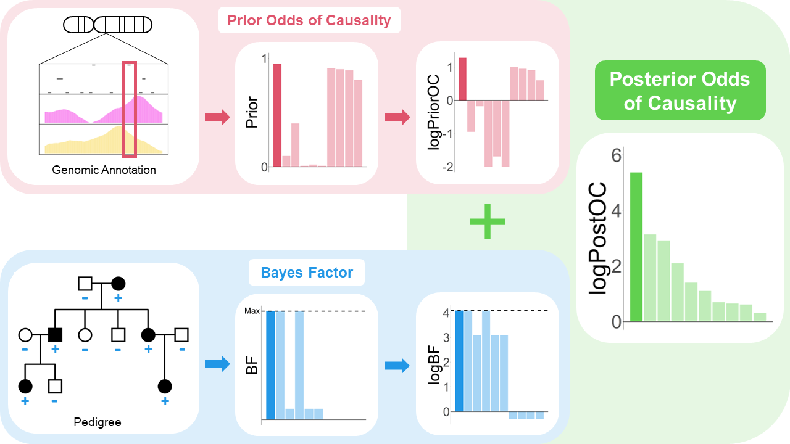

<!--


# Name of the project &middot; [](https://travis-ci.org/npm/npm) [](https://www.npmjs.com/package/npm) [](http://makeapullrequest.com) [](https://github.com/your/your-project/blob/master/LICENSE)
> Additional information or tag line

```
----------------------------------------
         _   ___   __   __   _
        |_)   |   /    |_   |_)
        |_)  _|_  \__  |__  |

        Bayesian Inference for
   Causality Evaluation in Pedigrees
----------------------------------------

```
-->

# BICEP
A <ins>B</ins>ayesian <ins>I</ins>nference model for <ins>C</ins>ausality <ins>E</ins>valuation in <ins>P</ins>edigrees. 




## Installing / Getting started

A quick introduction of the minimal setup you need to get a hello world up &
running.

```shell
commands here
```

Here you should say what actually happens when you execute the code above.

## Developing

### Built With
List main libraries, frameworks used including versions (React, Angular etc...)

### Prerequisites
What is needed to set up the dev environment. For instance, global dependencies or any other tools. include download links.


### Setting up Dev

Here's a brief intro about what a developer must do in order to start developing
the project further:

```shell
git clone https://github.com/your/your-project.git
cd your-project/
packagemanager install
```

And state what happens step-by-step. If there is any virtual environment, local server or database feeder needed, explain here.

## Tests

Describe and show how to run the tests with code examples.
Explain what these tests test and why.

```shell
Give an example
```

## Licensing

State what the license is and how to find the text version of the license.
