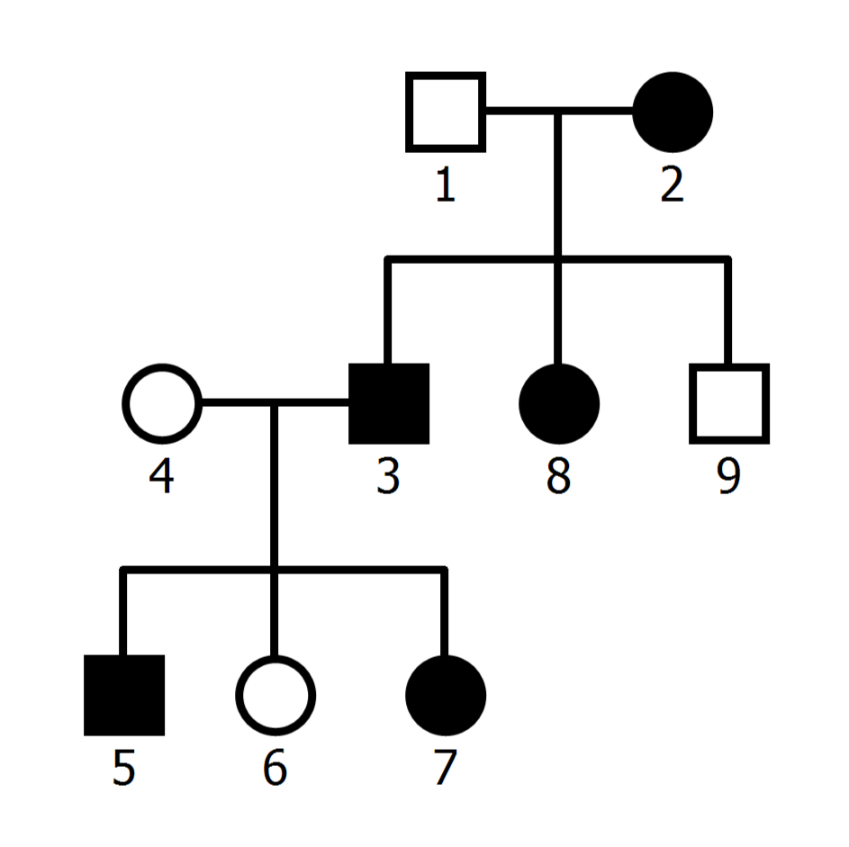
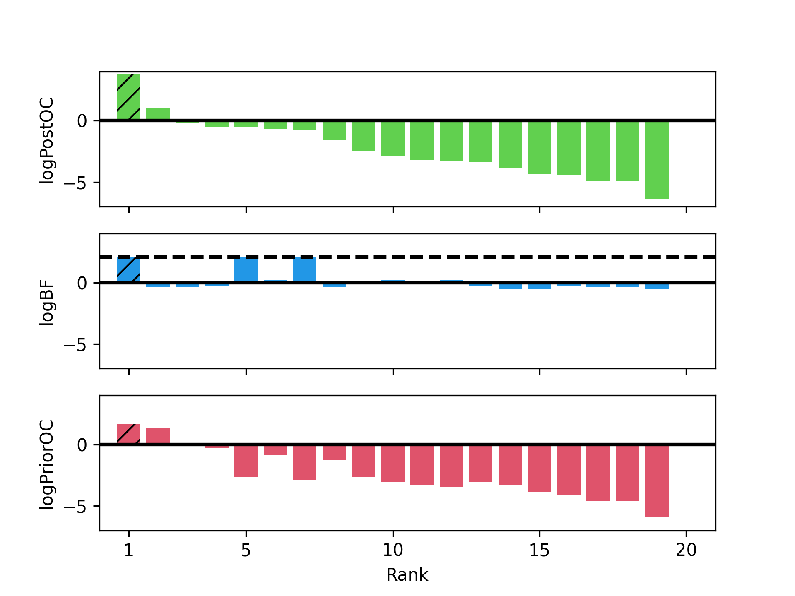

<!--


# Name of the project &middot; [](https://travis-ci.org/npm/npm) [](https://www.npmjs.com/package/npm) [](http://makeapullrequest.com) [](https://github.com/your/your-project/blob/master/LICENSE)
> Additional information or tag line

```
----------------------------------------
         _   ___   __   __   _
        |_)   |   /    |_   |_)
        |_)  _|_  \__  |__  |

        Bayesian Inference for
   Causality Evaluation in Pedigrees
----------------------------------------

```
-->

# BICEP
A **B**ayesian **I**nference model for **C**ausality **E**valuation in **P**edigrees. 

BICEP uses a Bayesian inference model to evaluate if a protein-coding variant is causal for a phenotype in a pedigree. 
An overview of the model is given in the figure below, and a full description is given in the wiki. 
First, BICEP calulates a prior odds for causality (PriorOC) based on genomic annotation information such as allele frequency, deleteriousness, functional consequence, etc.
Then BICEP calculates a Bayes factor (BF) which measures the likelihood of the pedigree data if the variant were causal for the phenotype versus if it were neutral. 
These are combined (on the base 10 logarithmic scale) to get the final posterior odds of causality (logPostOC) which is used to rank the variants. 
The logPostOC can be used an absolute measure of a variant's causality or to compare the evidence between variants (see example below). 


If you use BICEP, please credit this GitHub repository. 


## Installation
Clone the repostory:


```shell
git clone https://github.com/cathaloruaidh/BICEP.git
```

Install the required python libraries:

```
python3 -m pip install --user -r BICEP/requirements.txt
```


## Test
To test the installation, simulated genomic, phenotypic, and pedigree data are supplied in the `test/` directory. 
The F1 pedigree (figure below) has a simulated phenotype spanning three generations that is "caused" by a rare, deleterious, missense variant (chr1:1355461:A:C, *MXRA8*:p.Leu122Arg) inherited from a single common ancestor. 
This variant is the only missense variant in the data that perfectly co-segregates with the phenotype, and as such should be highly ranked by BICEP.
While the pedigree is simulated, the variants were taken from the gnomAD database, and the annotation metrics are all real. 



The following will run BICEP on the test pedigree: 


```
./BICEP/src/BICEP.py All \
	--vcf ./BICEP/test/F1.vep.vcf \
	--fam ./BICEP/test/F1.fam \
	--prefix F1 \
	--cores 1 \
	--highlight "chr1_1355461_A_C" \
	--top 20
```

The following image will be produced which displayes the output BICEP metrics for each variant scored by the tool. 
Additional details are given in the output ".posteriors.txt" file. 



The "causal" variant is highlighted with the hatched pattern and ranks first according to the logPostOC (as expected). 
Only the top two variants had positive logPostOC scores, which indicate overall evidence for causality. 
The top ranked variant has a logPostOC of $3.77$, so it is $10^{3.77} \approx 5,889$ times more likely to be causal than neutral for the phenotype. 
The second ranked variant has a logPostOC of $1.01$. 
This means the first ranked variant has $10^{3.77 - 1.01} \approx 575$ times more evidence for causality than the second ranked variant. 

We can see three variants (ranked 1st, 5th, and 7th) have perfect co-segregation with the phenotype.
This is indicated by the dashed line in the logBF plot, which represents the maximum logBF value achievable in the pedigree. 
However only the first ranked variant of the three  had a positive logPostOC (and logPriorOC) scores.
Therefore the first ranked variant is the most plausible candidate based on the genomic data. 
